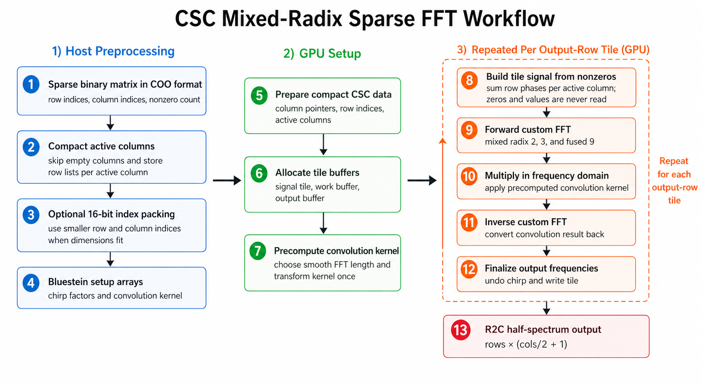
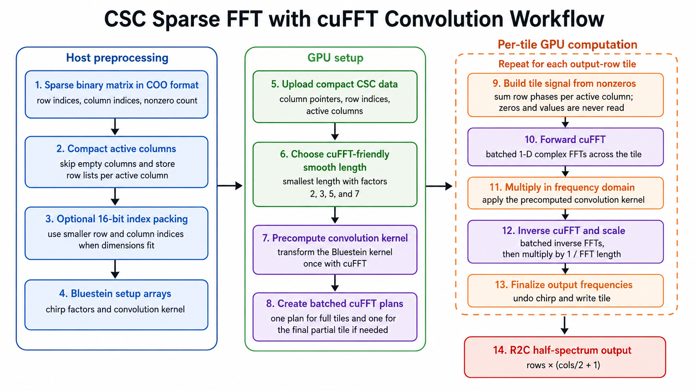

# CSC 766 Course Project: cuSpFFT — Efficient GPU FFT Leveraging Binary Sparsity

A CUDA implementation of 2-D FFT optimized for **binary sparse matrices**,
targeting graph adjacency matrices and similar inputs where dense FFT is
either too slow or runs out of memory. This repository is the course
submission artifact: it contains the complete implementation, benchmark
driver, dataset download script, dense cuFFT and SpFFT comparisons,
profiling helpers, and the performance notes needed to reproduce the
reported results.

The codebase explores how far a custom GPU pipeline can go by exploiting
two structural properties of the input:
1. **Sparsity** — only the ~`nnz` nonzero entries contribute to the DFT sum;
   the implementation never materializes the dense `rows × cols` grid.
2. **Binarization** — every nonzero is exactly 1, so the values array is
   eliminated entirely and indices are bit-packed (`uint16_t` when
   `rows, cols ≤ 65k`).

## Quick start

The fastest path to compile and run the core GPU benchmark is:

```bash
git clone <this-repository-url>
cd cuSpFFT

cmake -S . -B build \
    -DCMAKE_BUILD_TYPE=Release \
    -DCMAKE_CUDA_ARCHITECTURES=native
cmake --build build -j$(nproc)

./scripts/download_matrices.sh

./build/cuSpFFT dataset/benzene/benzene.mtx \
    --csc-mixed-radix \
    --csc-cufft-smooth \
    --csc-tile 128 \
    --repeat 10
```

Dense cuFFT runs by default. The command above adds the two reported
binary-sparse variants and requires only CUDA/cuFFT. If CMake cannot find
`nvcc`, use the longer build command in the [Build](#build) section with
`-DCMAKE_CUDA_COMPILER=/path/to/nvcc`.

For the full comparison with SpFFT and the FFTW CPU correctness reference,
build with `-DENABLE_SPFFT=ON -DENABLE_CPU_REFERENCE=ON` as shown in the
[Build](#build) section, then add `--spfft --cpu-reference` to the run
command.

## Repository layout

```
cuSpFFT/
├── CMakeLists.txt
├── README.md
├── include/
│   ├── mtx_reader.h            # COO/CSR parser interface
│   ├── dense_baseline.h        # Dense cuFFT baseline interface
│   ├── cpu_reference.h         # CPU FFT (FFTW3) ground-truth interface
│   ├── sparse_fft.h            # All sparse FFT public APIs
│   └── sparse_fft_internal.cuh # Shared device helpers, constants, CSC builder
├── src/
│   ├── main.cu                 # CLI entry, benchmark loop, correctness check
│   ├── mtx_reader.cu           # Matrix Market .mtx parser (binarizes values)
│   ├── dense_baseline.cu       # Dense scatter + cufftExecR2C baseline
│   ├── cpu_reference.cpp       # CPU FFTW3 reference (built when ENABLE_CPU_REFERENCE=ON)
│   └── sparse_fft_bluestein.cu # Main sparse FFT variants and ablations
├── dataset/                    # Place .mtx files here
├── profiles/                   # Saved Nsight Compute / Systems reports
└── scripts/
    ├── download_matrices.sh    # Downloads the three benchmark matrices
    └── profile.sh              # Nsight Compute profiling helper
```

| Path | Purpose |
|---|---|
| `src/main.cu` | Command-line benchmark driver. Parses flags, runs dense cuFFT, SpFFT, and sparse variants, and prints timing, memory, and correctness results. |
| `src/sparse_fft_bluestein.cu` | All binary-sparse FFT variants: the two reported methods (`--csc-mixed-radix`, `--csc-cufft-smooth`) plus experimental Bluestein/Stockham/cuFFT ablations (see Appendix). |
| `src/dense_baseline.cu` | Dense cuFFT baseline: scatters sparse input into a dense array and runs `cufftExecR2C`. |
| `src/mtx_reader.cu` | Matrix Market reader. Loads `.mtx` files and binarizes all nonzero values to `1`. |
| `src/cpu_reference.cpp` | Optional FFTW3 CPU reference used for correctness checking when `ENABLE_CPU_REFERENCE=ON`. |
| `include/` | Header interfaces for matrix loading, dense baseline, CPU reference, and sparse FFT variants. |
| `scripts/download_matrices.sh` | Downloads the benchmark matrices from SuiteSparse into `dataset/`. |
| `scripts/profile.sh` | Runs Nsight Compute profiling for selected kernels. |
| `dataset/` | Local benchmark inputs. This directory can be regenerated with `scripts/download_matrices.sh`. |
| `profiles/` | Optional saved Nsight reports used as supporting profiling evidence. |

The reported sparse methods (`--csc-mixed-radix`, `--csc-cufft-smooth`) and the
experimental ablation variants (`--csc-stockham-smem`, `--csc-stockham-cufft`,
`--csc-stockham-cufft-stream`, `--csc-binary-lut`, `--csc-binary-stockham-smem`,
`--csc-mixed-radix-graph`) all live in `src/sparse_fft_bluestein.cu`. 

## Machine configuration used for the results

| Component | Value |
|---|---|
| GPU | NVIDIA GeForce RTX 4090 (24 GB, compute capability 8.9) |
| Driver | 555.42.02 |
| CUDA Toolkit | 12.5.82 |
| CMake | 3.20+ |
| OS | Linux x86_64 |

## Build

### Requirements

- NVIDIA GPU with CUDA support.
- CUDA Toolkit 12.x or another compatible CUDA installation providing
  `nvcc`, cuFFT, cuBLAS, cuSPARSE, and NVTX.
- CMake 3.20+ and a C++17 compiler.
- Optional: FFTW3 single-precision for `--cpu-reference`.
- Optional: SpFFT built with CUDA and single precision for `--spfft`.

### Standard build

This build is enough to run dense cuFFT and the two main binary-sparse GPU
variants. It does not require SpFFT or FFTW.

```bash
cmake -S . -B build \
    -DCMAKE_BUILD_TYPE=Release \
    -DCMAKE_CUDA_ARCHITECTURES=native

cmake --build build -j$(nproc)
```

If CMake cannot find `nvcc`, add
`-DCMAKE_CUDA_COMPILER=/path/to/nvcc` to the configure command. If `native`
architecture detection does not work on the target machine, replace it with
the GPU's architecture number, for example `89` for RTX 4090.

### Optional full evaluation build

The complete comparison in the Performance section uses two optional
dependencies:

- `ENABLE_SPFFT=ON` enables the SpFFT baseline.
- `ENABLE_CPU_REFERENCE=ON` enables the FFTW3 CPU reference used for
  correctness checks.

SpFFT must be installed separately with CUDA backend and single precision.
One working configuration is:

```bash
cmake -S /path/to/spfft -B /tmp/spfft-build \
    -DSPFFT_GPU_BACKEND=CUDA -DSPFFT_SINGLE_PRECISION=ON \
    -DSPFFT_MPI=OFF -DSPFFT_OMP=OFF \
    -DCMAKE_INSTALL_PREFIX=$HOME/local \
    -DCMAKE_INSTALL_RPATH=$HOME/local/lib \
    -DCMAKE_BUILD_WITH_INSTALL_RPATH=ON
cmake --build /tmp/spfft-build --target install -j$(nproc)
```

SpFFT requires both `libfftw3` and `libfftw3f`. The CPU reference path
requires `libfftw3f`. To build FFTW3 single-precision locally:

```bash
cd /tmp && curl -L -O https://www.fftw.org/fftw-3.3.10.tar.gz
tar xzf fftw-3.3.10.tar.gz && cd fftw-3.3.10
./configure --prefix=$HOME/local --enable-float --enable-shared
make -j$(nproc) && make install
```

Then configure this project with both optional paths enabled:

```bash
cmake -S . -B build \
    -DCMAKE_BUILD_TYPE=Release \
    -DCMAKE_CUDA_ARCHITECTURES=native \
    -DENABLE_SPFFT=ON \
    -DENABLE_CPU_REFERENCE=ON \
    -DCMAKE_PREFIX_PATH=$HOME/local
cmake --build build -j$(nproc)
```

CMake searches `$HOME/local`, `/usr/local`, and `/usr` for FFTW3 headers
and libraries. If SpFFT or FFTW is installed somewhere else, add that prefix
to `-DCMAKE_PREFIX_PATH`.

## Benchmark matrices

```bash
./scripts/download_matrices.sh   # downloads all three from SuiteSparse
```

| Matrix | Source | Size | Role |
|---|---|---|---|
| `HB/sstmodel` | [SuiteSparse / HB/sstmodel](https://sparse.tamu.edu/HB/sstmodel) | 3,345 × 3,345 (~22.7k nnz) | Dev / correctness checks (small) |
| `PARSEC/benzene` | [SuiteSparse / PARSEC/benzene](https://sparse.tamu.edu/PARSEC/benzene) | 8,219 × 8,219 (~242k nnz) | Headline comparison vs dense cuFFT |
| `Boeing/pct20stif` | [SuiteSparse / Boeing/pct20stif](https://sparse.tamu.edu/Boeing/pct20stif) | 52,329 × 52,329 (~2.7M nnz) | Large-scale OOM test (>50k nodes) |

All values are binarized to 1 on read — the algorithms exploit only the
sparse pattern, not the original numeric values.

---

## Main performance methods

The high-performance work is concentrated in the CSC Bluestein pipeline in
`src/sparse_fft_bluestein.cu`:

- **Sparse-first data movement:** Matrix Market input is converted from COO
  to a compact CSC form, and the dense `rows × cols` real grid is never
  materialized by the sparse variants.
- **Binary specialization:** Nonzeros are implicit `1.0`, so kernels load
  only row/column indices and skip the value multiply required by a general
  sparse matrix.
- **Packed indices:** For the required matrices (`rows, cols ≤ 65,536`),
  active columns and row indices use `uint16_t` on device, cutting index
  bandwidth in half.
- **Tiled output rows:** The transform processes row-frequency tiles
  (`--csc-tile`, 128 for reported runs), keeping intermediate memory
  proportional to `tile × fft_len` instead of `rows × cols`.
- **Bluestein transform:** Arbitrary matrix widths are handled through a
  convolution at a smooth FFT length rather than padding to a much larger
  power of two.
- **Mixed-radix Stockham FFT:** The no-cuFFT path uses custom radix-2,
  radix-3, and fused radix-9 Stockham kernels to reduce global-memory
  roundtrips.
- **CUDA event timing and peak-memory capture:** Each variant reports median
  runtime over repeated GPU timings and runtime peak device memory.

## CSC input layout

The reported sparse methods store the binary input in compact CSC form.
Each active column owns a contiguous slice of row indices:
`row_idx[col_ptr[c] .. col_ptr[c+1])`. Empty columns are skipped, and no
values array is stored because every nonzero is treated as `1`.

Pass 1 walks those column slices and builds the chirp-modulated signal used
by the Bluestein/Stockham column transform:
`signal[u][c] = (Σ_r exp(-2πi · r · u / rows)) · chirp[c]`, where the sum
ranges over the rows with a nonzero in column `c`. This makes one
`(u_tile, col_id)` pair the natural unit of GPU work. A thread block reads
one column slice, accumulates the contribution for its output-row tile, and
writes the corresponding `signal` entries without global atomics.

This layout keeps pass-1 memory traffic proportional to `O(nnz)` and gives
the kernel predictable memory access. Threads in a block share the same
`col_id`, so row-index reads tend to hit the same cache lines. On benzene,
the current column-oriented layout reduced the run time from roughly
32 ms to roughly 13 ms compared with an earlier row/scatter-oriented
prototype.

CSR and COO variants were useful during development and are kept for
ablation, but they are not used for the reported sparse methods. CSR groups
entries by source row, so producing column-grouped `signal` data requires
either an explicit transpose or scatter updates into a shared intermediate
array. The CSR prototype used scatter updates and was slower on `sstmodel`
and `benzene`. COO was best for the old direct-DFT prototype, where every
nonzero contributes to every output bin, but direct DFT is
`O(nnz × rows × cols)` and is not competitive at the required matrix sizes.

# Variants implemented

The reported comparison includes four performance variants: dense cuFFT
(`src/dense_baseline.cu`), SpFFT (`--spfft`), our custom binary-sparse
FFT with no cuFFT calls (`--csc-mixed-radix`), and the same binary-sparse
pipeline using cuFFT only for the 1-D Bluestein convolution
(`--csc-cufft-smooth`). The CPU FFTW3 path (`--cpu-reference`) is
correctness-only ground truth, not a performance competitor.

Every other `--csc-*` flag is **experimental / ablation only** — kept
in the tree for profiling and individual-component studies but not part
of the reported numbers. Notable among these is
`--csc-stockham-cufft-stream`, the streaming variant we report separately
for pct20stif because its `~474 MB` device peak is the only configuration
that fits the >50k-node case on a 24 GB GPU. The full ablation list is
in the [Appendix](#appendix-experimental-variants-and-future-directions).

## 0. CPU FFT reference (FFTW3 single-precision, optional)

**Source:** `src/cpu_reference.cpp`, function `cpu_fft_r2c_2d()`.
**Flag:** `--cpu-reference` (requires `-DENABLE_CPU_REFERENCE=ON` build).

This path is used for correctness, not performance comparison. It computes
the same 2-D real-to-complex FFT on the CPU with FFTW3 single precision and
uses that output as an independent reference for the GPU implementations.
When `--cpu-reference` is passed, the CPU FFT runs before any GPU variant.
Dense cuFFT, SpFFT, and the sparse CUDA methods are then compared against
the same host-computed result.

Pipeline:
1. Allocate FFTW-aligned host buffers and scatter the binarized COO input
   into the dense
   `rows × cols` real input.
2. Create a single-precision R2C plan with
   `fftwf_plan_dft_r2c_2d(rows, cols, ..., FFTW_ESTIMATE)`.
3. Execute the plan with `fftwf_execute`.
4. Store the host-side complex output with shape `rows × (cols/2 + 1)`;
   this layout is compatible with the `cuFloatComplex` outputs used by the
   CUDA variants.

## 1. Dense cuFFT (baseline)

**Source:** `src/dense_baseline.cu`, function `dense_fft()`.

This is the standard dense GPU baseline. It does not exploit sparsity: the
input matrix is first expanded into a dense real array, then cuFFT computes
the 2-D FFT.

Pipeline:
1. Scatter the COO entries into a dense `rows × cols` `float` array on device
   (`coo_to_dense` kernel; uses 64-bit index arithmetic to avoid `int32`
   overflow at 50k+ rows).
2. Run `cufftExecR2C` for an out-of-place real-to-complex 2-D FFT.
3. Output is `rows × (cols/2 + 1)` complex (R2C half-spectrum).

Its peak memory is dominated by:

- Dense input: `rows × cols × 4` bytes.
- Complex output: `rows × (cols/2 + 1) × 8` bytes.
- cuFFT row-column transpose scratch: roughly equal to the output size.

For pct20stif (52,329²), the exact dense path fails at
`cufftPlan2d(&plan, 52329, 52329, CUFFT_R2C)` before execution with
`CUFFT_INTERNAL_ERROR` because `52329 = 3 × 17443` (17443 is prime and is
hostile to cuFFT's planner). Padding to the next 7-smooth size, 52,488²,
makes the plan succeed, but the in-place workspace alone needs about
10.5 GB on top of about 11 GB for the dense data. That total exceeds the
available memory margin on the 24 GB RTX 4090 used for testing.

For this reason, exact dense cuFFT does not produce a result for the
\>50k-node pct20stif case.

## 2. SpFFT (baseline reference)

**Source:** inline in `src/main.cu` (under `#ifdef HAS_SPFFT`).
**External library:** [eth-cscs/SpFFT](https://github.com/eth-cscs/SpFFT)
(MIT-licensed, plane-wave DFT library by CSCS).

SpFFT is a CUDA-aware sparse-frequency FFT library used in plane-wave
electronic-structure codes. Its sparsity model is different from this
project's input-sparse setting: SpFFT transforms dense spatial data and
returns a selected sparse set of frequency points. The benchmark adapts it
to this project by requesting the full R2C output frequency set.

The reported SpFFT numbers use an `-DENABLE_SPFFT=ON` build with SpFFT's
CUDA backend in single precision. SpFFT was configured without MPI or
OpenMP (`SPFFT_MPI=OFF`, `SPFFT_OMP=OFF`). Timing covers the GPU
`transform.forward()` call after the SpFFT grid and transform objects have
been constructed.

Pipeline:
1. Scattering the COO entries into the SpFFT space-domain GPU buffer.
2. Configuring SpFFT with **all** R2C frequency triplets `(x, y, 0)` for
   `x ∈ [0, cols/2]`, `y ∈ [0, rows−1]`, `z = 0` — i.e. the full output.
3. Running `transform.forward(SPFFT_PU_GPU, ...)` and reading the result.

This baseline is included because it is a CUDA sparse FFT library evaluated
on the same matrices. It does not exploit the binary input values, and its
internal model adds overhead for this dense-output use case: 3-D layout with
`dimZ = 1`, sparse-frequency indexing, and single-rank setup. The measured
results are reported in the Performance section.

## 3. CSC mixed-radix, custom 1-D FFT (`--csc-mixed-radix`)

**Source:** `src/sparse_fft_bluestein.cu`, function
`sparse_fft_csc_bluestein_mixed_radix()`.

This is the fully custom sparse GPU implementation. It uses the binary CSC
front end described above and a custom mixed-radix Stockham FFT for the
Bluestein convolution. No cuFFT calls are used in this variant.

### Pipeline



The diagram shows the overall workflow: compact the sparse binary input by
active column, precompute the Bluestein convolution kernel once, process
the output rows in tiles, run the custom mixed-radix FFT convolution for
each tile, and write the R2C half-spectrum output.

### Implementation details

#### Compact CSC representation

The host builds a *compact* CSC where columns with no nonzeros are skipped:
- `sparse_cols`: the list of active column indices.
- `col_ptr`: prefix-sum offsets into `row_idx` (length `n_sparse_cols + 1`).
- `row_idx`: row indices of nonzeros.

For matrices with `rows, cols ≤ 65,536`, both `sparse_cols` and `row_idx`
are stored as `uint16_t` on device — halving the index bandwidth. There is
no `values` array because every nonzero is 1.

#### Pass-1 build kernel (`csc_build_bluestein_input_packed_kernel`)

For each output-row tile `[u_base, u_base + tile_rows)`, build the
chirp-modulated signal:

```
signal[u_local, c] = chirp[c] · Σ_{r ∈ rows(c)} exp(−2πi · r · u / rows)
```

Layout: `blockIdx.x = col_id`, `blockIdx.y` = u-block index,
`threadIdx.x = u_local within the block`. All threads in a block share the
same `col_id`, so `row_idx[p]` reads hit the L1 broadcast path instead of
scattering across 32 distinct `col_id` rows. An earlier 2-D layout had
91% wasted L2 sector traffic from strided `row_idx` access; the current
column-oriented layout avoids that pattern.

The kernel iterates only the `nnz` row indices in each column — never
visits zero entries. No `values` are loaded because every nonzero is 1.

#### Bluestein with `next_3_smooth(2·cols−1)` FFT length

The Bluestein chirp-z transform converts an arbitrary-length-`cols` DFT
into a length-`fft_len` convolution, where `fft_len ≥ 2·cols − 1`. This
variant uses the **smallest 3-smooth size** ≥ `2·cols − 1` (factors only
from {2, 3}) so the custom FFT engine can use radix-2, radix-3, and
radix-9 stages.

- For `benzene` (`cols = 8219`): `2·cols−1 = 16437` → `fft_len = 17496 = 2³·3⁷`.
  A power-of-two length, 32768, would do ~1.87× more FFT work.
- For `sstmodel` (`cols = 3345`): `fft_len = 6912 = 2⁸·3³` (vs 8192 pow2).
- For `pct20stif` (`cols = 52329`): `fft_len = 110592 = 2¹²·3³` (vs 131072).

#### Custom radix-{2, 3, 9} Stockham kernels

Three kernels in `sparse_fft_bluestein.cu` make up the FFT:
- `stockham_stage_kernel` — radix-2 Stockham butterfly, one stage per launch.
- `stockham_radix3_stage_kernel` — radix-3 Stockham butterfly with output
  twiddle.
- `stockham_radix9_stage_kernel` — **fused radix-9** = two radix-3 stages
  in registers via the 3×3 Kronecker decomposition. Replaces 2
  global-memory roundtrips with 1.

The host driver `run_fft_mixed_23` decomposes `fft_len` into a factor list
that prefers radix-9 over pairs of radix-3:

| `fft_len` | Factor list | # global passes |
|---|---|---|
| 6912 = 2⁸·3³ | `[9, 3, 2, 2, 2, 2, 2, 2, 2, 2]` | 10 |
| 17496 = 2³·3⁷ | `[9, 9, 9, 3, 2, 2, 2]` | 7 |
| 110592 = 2¹²·3³ | `[9, 3, 2, 2, 2, 2, 2, 2, 2, 2, 2, 2]` | 12 |

Compared to a pure radix-2 Stockham at `next_pow2`, this is **roughly half**
the FFT work on benzene because both `fft_len` and the number of stages are
smaller. Nsight Compute profiling shows the FFT stages are memory-bandwidth
bound at roughly 85% of DRAM peak, so fusing two radix-3 stages into one
radix-9 stage directly reduces the dominant global-memory traffic.

### Memory

- One tile of `signal[tile_rows, fft_len]` and one ping-pong work buffer of
  the same size — `2 × tile × fft_len × 8` bytes.
- Full output `d_out[rows, output_stride]` on device.
- Negligible: `chirp[cols]`, `B_fft[fft_len]`, packed CSC indices.

### Discussion

This variant is the main evidence that the sparse binary formulation is
useful independently of cuFFT. It avoids the dense input grid, stores no
nonzero values, packs indices when possible, and uses a custom FFT engine
for the Bluestein convolution. On benzene, it is faster than dense cuFFT
while using substantially less memory. The remaining gap to the
cuFFT-backed sparse variant is mainly in the 1-D FFT engine, not in the
sparse CSC front end.

## 4. CSC mixed-radix, cuFFT 1-D FFT (`--csc-cufft-smooth`)

**Source:** `src/sparse_fft_bluestein.cu`, function
`sparse_fft_csc_bluestein_cufft_smooth()`.

This variant keeps the same binary CSC front end and Bluestein transform
structure as `--csc-mixed-radix`, but uses cuFFT for the 1-D convolution
FFTs inside each output-row tile. It is useful for separating the benefit
of the sparse/binary front end from the performance of the custom FFT
engine.



The workflow is:

1. Build the same compact CSC representation and optional 16-bit packed
   index arrays.
2. Precompute the Bluestein convolution kernel once using a cuFFT C2C plan.
3. For each output-row tile, build the sparse tile signal from active
   columns and nonzero row indices.
4. Run cuFFT forward C2C transforms over the tile.
5. Multiply by the precomputed convolution kernel in the frequency domain.
6. Run cuFFT inverse C2C transforms, scale by `1 / fft_len`, undo the chirp,
   and write the R2C half-spectrum tile to `d_out`.

Main differences from `--csc-mixed-radix`:

- `fft_len = next_7_smooth(2·cols − 1)` (factors from {2, 3, 5, 7}). cuFFT
  handles 7-smooth sizes efficiently, so this variant can use a smaller
  convolution length than the custom radix-{2,3,9} path.
  - benzene: 16464 = 2⁴·3·7³ (vs 17496 for 3-smooth, 32768 for pow2)
  - sstmodel: 6720 = 2⁶·3·5·7 (vs 6912, 8192)
  - pct20stif: 110592 (same as 3-smooth here — already smooth enough)
- `cufftPlanMany` creates batched 1-D C2C plans for full tiles and, when
  needed, the final partial tile.
- The pass-1 signal build, sparse/binary input representation, pointwise
  multiply, scaling, and final writeback are shared with the custom variant.

### Discussion

This variant measures the sparse binary front end with a highly optimized
library FFT backend. It is the fastest reported sparse method on benzene and
also the fastest sparse method on `pct20stif`, but it uses cuFFT inside the
1-D Bluestein convolution. The comparison with `--csc-mixed-radix` shows
that most of the remaining performance opportunity is in improving the
custom FFT backend, while the CSC/binary preprocessing remains effective in
both versions.

---

# Usage

General command form:

```bash
./build/cuSpFFT <matrix.mtx> [options]
```

Dense cuFFT runs by default. The sparse methods, SpFFT baseline, and CPU
reference are enabled explicitly with flags. Use `--repeat 10` for the
reported median timings: the program performs one warmup run and then ten
timed runs.

### Standard run

This command works with the standard build and runs dense cuFFT plus the
two reported binary-sparse GPU methods:

```bash
./build/cuSpFFT dataset/benzene/benzene.mtx \
    --csc-mixed-radix \
    --csc-cufft-smooth \
    --csc-tile 128 \
    --repeat 10
```

### Full comparison runs

These commands require the optional build with
`-DENABLE_SPFFT=ON -DENABLE_CPU_REFERENCE=ON`. They reproduce the reported
small and main comparison tables:

```bash
# Small correctness/performance case
./build/cuSpFFT dataset/sstmodel/sstmodel.mtx \
    --cpu-reference \
    --spfft \
    --csc-mixed-radix \
    --csc-cufft-smooth \
    --csc-tile 128 \
    --repeat 10

# Main reported case
./build/cuSpFFT dataset/benzene/benzene.mtx \
    --cpu-reference \
    --spfft \
    --csc-mixed-radix \
    --csc-cufft-smooth \
    --csc-tile 128 \
    --repeat 10
```

For the large `pct20stif` stress test, the CPU reference is usually omitted
because it is slow and host-memory heavy. Dense cuFFT and SpFFT are expected
to fail on this matrix on the reported test machine, but the sparse methods
still run:

```bash
./build/cuSpFFT dataset/pct20stif/pct20stif.mtx \
    --spfft \
    --csc-mixed-radix \
    --csc-cufft-smooth \
    --csc-tile 128 \
    --repeat 10
```

## CLI flags relevant to the reported variants

| Flag | Effect |
|---|---|
| (default) | Dense cuFFT baseline runs unless `--sparse-only` |
| `--cpu-reference` | Run CPU FFTW3 first and use it as the correctness reference for all variants (requires `-DENABLE_CPU_REFERENCE=ON`) |
| `--spfft` | Run the SpFFT baseline (requires `-DENABLE_SPFFT=ON` build) |
| `--csc-mixed-radix` | Variant 3 — binary CSC + custom radix-{2,3,9} Stockham |
| `--csc-cufft-smooth` | Variant 4 — binary CSC + cuFFT at 7-smooth fft_len |
| `--csc-tile N` | Output-row tile size for tiled CSC methods. The reported runs use `--csc-tile 128`; default is 1024. |
| `--repeat N` | Run one warmup plus `N` timed iterations and report median/min/max. Default is 1 timed run with no warmup. |
| `--sparse-only` | Skip the dense cuFFT baseline |
| `--dense-only` | Skip the sparse variants |

Additional flags exist for ablation studies; see the **Appendix** for the
list. Run `./build/cuSpFFT --help` for the complete reference.

---

# Performance

Timings are medians of 10 measured runs after one warmup
(`--repeat 10`). GPU time is measured with CUDA events around the benchmarked
kernel/FFT loop. Memory is the runtime peak device allocation measured with
`cudaMemGetInfo`; it includes cuFFT/SpFFT internal workspace in addition to
explicit project allocations.

Correctness is reported as `max_abs vs CPU`, the worst element-wise
absolute error against the FFTW3 CPU reference from `--cpu-reference`.

## Medium matrix: benzene (8,219 × 8,219, density 0.36%, `--csc-tile 128`)

| Variant | Median (ms) | Min / Max | Memory (MB) | max_abs vs CPU | vs Dense cuFFT |
|---|---|---|---|---|---|
| CPU FFT reference (FFTW3) | — | — | — | (correctness reference; not benchmarked) | — |
| Dense cuFFT | 23.64 | 23.59 / 23.68 | 3,305 | 4.7e-02 | — |
| SpFFT | ~32 | (single-run) | ~4,400 | 4.7e-02 | 0.74× speed |
| **CSC mixed-radix (custom 1-D FFT)** | **14.65** | **14.61 / 14.66** | **310** | **2.0e-01** | **1.61× faster, 10.7× less memory** |
| CSC mixed-radix (cuFFT 1-D FFT) | 9.60 | 9.60 / 9.62 | 317 | 6.3e-02 | 2.46× faster, 10.4× less memory |

On benzene, both sparse CSC variants beat dense cuFFT and use about one
tenth of the device memory. The cuFFT-backed sparse variant is the fastest
overall on this matrix, while the fully custom variant still beats dense
cuFFT without using cuFFT inside the sparse algorithm.

## Small matrix: sstmodel (3,345 × 3,345, density 0.20%)

| Variant | Median (ms) | Memory (MB) | max_abs vs CPU |
|---|---|---|---|
| CPU FFT reference (FFTW3) | — | — | (correctness reference; not benchmarked) |
| Dense cuFFT | 0.85 | 289 | 3.1e-03 |
| SpFFT | 2.08 | 457 | 3.1e-03 |
| CSC mixed-radix (custom) | 3.62 | 65 | 2.0e-02 |
| CSC mixed-radix (cuFFT) | 1.39 | 59 | 6.0e-03 |

On small matrices, dense cuFFT remains faster because the sparse methods do
not have enough work to amortize CSC preprocessing and per-tile kernel
launch overhead. The sparse methods still use much less memory.

## Large matrix: pct20stif (52,329 × 52,329, density 0.10%)

| Variant | Outcome | Runtime | Peak memory |
|---|---|---:|---:|
| Dense cuFFT (baseline) | Failed during exact `cufftPlan2d` creation (`CUFFT_INTERNAL_ERROR`) | — | — |
| SpFFT | Failed due to device-memory exhaustion in the single-rank configuration | — | — |
| CSC mixed-radix (custom 1-D FFT) | Completed | 2,569 ms | 11.2 GB |
| CSC mixed-radix (cuFFT 1-D FFT) | Completed | 893 ms | 11.3 GB |

For the large matrix, exact dense cuFFT does not reach execution on the
reported machine because plan creation fails. SpFFT runs out of memory in
the single-rank configuration used here. Both sparse CSC variants complete,
but they are memory-tight because they keep the full output on device. The
Appendix describes a streaming variant that bounds device memory by tile
size and runs pct20stif at about 474 MB.

## Sparse Binary Optimizations

The sparse methods are specialized for matrices whose nonzero entries are
binary. The implementation uses this assumption in both the input
representation and the GPU computation.

- **Implicit nonzero values:** Nonzero values are treated as `1`, so the
  sparse input is represented only by row and column indices. Pass 1 does
  not load a values array or multiply by a stored value, reducing storage
  and memory bandwidth compared with a general sparse matrix format.
- **Compact active-column storage:** The input is converted to compact CSC.
  Empty columns are omitted, and each active column stores only the row
  indices that contain nonzeros. Pass 1 iterates over nonzeros instead of
  scanning the dense `rows × cols` grid.
- **16-bit index packing:** When `rows, cols ≤ 65,536`, row indices and
  active-column indices are stored as `uint16_t` on the device. This halves
  index bandwidth for the reported matrices.
- **Tiled intermediate storage:** Output rows are processed in tiles. Only
  `signal[tile_rows, fft_len]` and one work buffer are needed for the
  current tile, so intermediate memory scales with `tile_rows × fft_len`
  rather than the full dense input matrix.
- **No dense input materialization:** The dense real matrix used by the
  cuFFT baseline is never constructed in the sparse variants. The tile
  signal is built directly from compact CSC row lists, avoiding the dense
  input allocation and scatter step.
- **Smooth Bluestein convolution length:** The arbitrary-width column
  transform is expressed as a Bluestein convolution. The custom path uses a
  3-smooth length, and the cuFFT path uses a 7-smooth length, reducing FFT
  work compared with padding to the next power of two.
- **Fused radix-9 stages in the custom FFT:** The custom mixed-radix FFT
  fuses two radix-3 stages into one radix-9 stage, reducing global-memory
  roundtrips in the memory-bandwidth-bound FFT portion of the custom
  method.
- **Independent CPU reference:** The optional FFTW3 path computes the same
  R2C transform on the CPU before GPU variants run, providing a common
  correctness reference for dense cuFFT, SpFFT, and both sparse CUDA
  methods.

---

# Limitations and remaining issues

- **Small matrices:** On `sstmodel`, dense cuFFT is still faster. CSC
  construction, tiled execution, and many small kernel launches do not
  amortize at this size. A small-matrix path could reduce launch overhead
  and avoid unnecessary tiling.
- **Full output stored on device:** The reported sparse methods complete
  `pct20stif`, but peak memory is about 11 GB because the full R2C output
  remains resident on the GPU. The streaming path in the Appendix addresses
  this by copying output tiles to host memory as they complete.
- **Limited custom radix support:** The fully custom FFT currently supports
  radix 2 and radix 3, including fused radix 9. This requires 3-smooth
  Bluestein lengths; on `benzene`, the custom path uses `fft_len = 17496`,
  while the cuFFT-backed path can use the smaller 7-smooth length `16464`.
  Adding radix-5 and radix-7 stages would reduce this gap.

---

# Profiling

Profiling is optional and is included to show where the custom sparse path
spends GPU time. The helper script profiles the selected run with Nsight
Compute and stores the report under `profiles/`.

```bash
./scripts/profile.sh [matrix.mtx] [cuSpFFT options...]
```

The first argument is the matrix file. Any remaining arguments are forwarded
to `cuSpFFT`, so the sparse variant must be selected explicitly. The example
above profiles the custom mixed-radix variant on `benzene`.

The script wraps `ncu --set full` and filters for the CSC build, custom FFT,
pointwise multiply, scaling, and finalization kernels. The generated
`.ncu-rep` file can be opened with `ncu-ui`; text exports from previous runs
are also kept in `profiles/`.
Some systems restrict access to hardware counters. If profiling fails for
that reason, run with sufficient permissions or configure the NVIDIA driver
to allow non-admin profiling.

---

# Appendix: Experimental variants and future directions

This appendix lists implementation paths that are useful for ablation and
future development but are not part of the reported performance comparison.
They remain compiled and can be selected with their individual `--csc-*`
flags.

## Streaming for very-large matrices

The reported sparse methods keep the full R2C output on the GPU. For very
large matrices, that output dominates memory use; `pct20stif` requires
about 10.7 GB for the output alone. A streaming implementation avoids this
by processing output-row tiles, copying completed tiles to host memory, and
reusing the same device buffers for the next tile.

The current experimental streaming path is `--csc-stockham-cufft-stream`.
It uses the cuFFT-based Bluestein convolution and reduces the `pct20stif`
device peak to about 474 MB. The next step is to apply the same streaming
driver to the custom mixed-radix FFT path, producing a no-cuFFT streaming
variant for very large matrices.

## Byte-mask lookup-table pass 1

The `--csc-binary-lut` variant tests a more aggressive use of binary input
structure in pass 1. Instead of storing every row index independently, each
active column groups rows into byte positions. A byte mask records which of
the eight row positions inside that byte are nonzero.

For each output-row tile, the implementation precomputes two small tables:
one table for the contribution of each possible 8-bit mask, and one table
for the phase associated with each byte position. The pass-1 build then
uses table lookups and complex multiply-adds rather than calling `sincosf`
for every individual nonzero row.

This approach is useful as an ablation because it isolates whether the
binary nature of the matrix can reduce trigonometric work in the signal
build stage. It is not part of the reported comparison because the current
profile shows pass 1 is a small fraction of total runtime; the FFT stages
dominate. The LUT version also adds extra per-tile table storage and setup
work, so it is kept as an experimental path rather than the default sparse
method.

## Ablation flags

- `--csc-stockham-smem` — shared-memory Stockham backend for the Bluestein
  convolution. It is radix-2 only and falls back to the per-stage path when
  `fft_len > 4096`.
- `--csc-stockham-cufft` — non-streaming Bluestein path using cuFFT at
  `next_pow2(2·cols−1)`. The reported `--csc-cufft-smooth` variant replaces
  this with a smaller 7-smooth convolution length.
- `--csc-stockham-cufft-stream` — streaming version of the cuFFT Bluestein
  path. This is the low-memory path used to demonstrate `pct20stif` at
  about 474 MB device peak.
- `--csc-binary-lut` — byte-mask lookup-table pass-1 front end with the
  cuFFT streaming backend.
- `--csc-binary-stockham-smem` — same byte-mask lookup-table pass 1 with
  the shared-memory Stockham backend.
- `--csc-mixed-radix-graph` — CUDA Graph version of `--csc-mixed-radix`,
  intended to evaluate launch-overhead reduction.

---

# References

- [cuFFT documentation](https://docs.nvidia.com/cuda/cufft/)
- [NVIDIA cuSPARSE storage formats](https://docs.nvidia.com/cuda/cusparse/storage-formats.html)
- [SpFFT — open-source sparse FFT for CUDA](https://github.com/eth-cscs/SpFFT)
- [SuiteSparse Matrix Collection](https://sparse.tamu.edu/)
- [Matrix Market format](https://math.nist.gov/MatrixMarket/formats.html)
- [Bluestein chirp-z transform](https://en.wikipedia.org/wiki/Chirp_Z-transform)
- Temperton (1983), *Self-sorting in-place fast Fourier transforms* — Stockham auto-sort algorithm.
